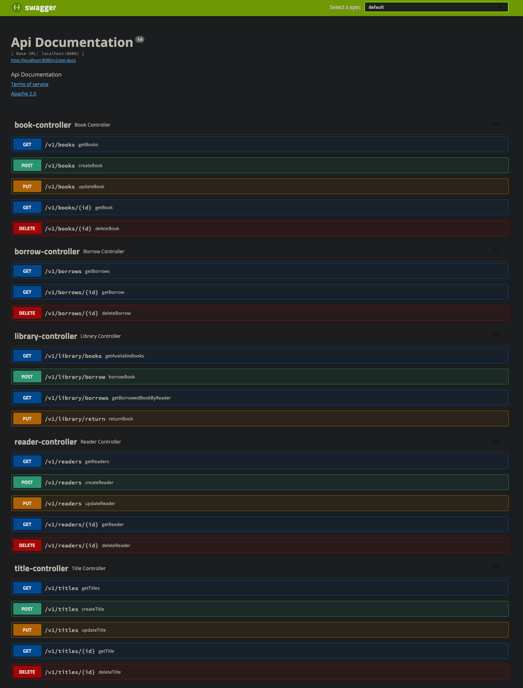

# Library - REST API

## Table of contents

* [Introduction](##Introduction)
* [Api_endpoints_documentation](##Api_endpoints_documentation)
* [Technology](##Technology)

## Introduction

This project was generated with java jdk-1.8.0_251 LTS version with Spring 5 and Spring Boot 2

To run application just make few steps:

1. Clone repository to some directory on your computer.
2. Create needed databases that are included in resources/application.properties files in main and test folders.
3. Run executable LibraryProjectApplication class and when application is running correctly you can go to step 4.
4. You can easily test application using swagger-io that is implemented in Backend project on an endpoint:
   http://localhost:8080/swagger-ui.html
5. Start with creating some Titles and Readers then create some Books. And after this you can play with Library and
   Borrow controllers :).

### Library is a simple REST API that has the capabilities to:

* Reader
    * create a Reader,
    * update a Reader,
    * delete a Reader,
    * get data about Readers.
* Book
    * create a Book,
    * update a Book,
    * delete a Book,
    * get data about Books.
* Title
    * create an Title,
    * update an Title,
    * delete an Title,
    * get data about Titles.
* Borrow
    * delete a Borrow,
    * get data about Borrows.
* Library
    * borrow Book from Library,
    * return Book to Library,
    * get books available in Library,
    * get borrowed books by Reader.

## Api_endpoints_documentation

## Technology

- Java 8
- JUnit
- Gradle
- Spring
- Spring Boot
- H2 database
- PostgreSQL database
- Swagger
